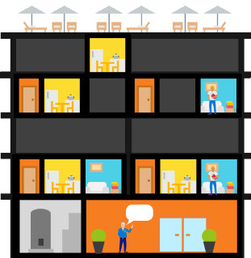

# Windows Containers

## What are Containers

Containers are a way to wrap up an application into its own isolated box. For the application in its container, it has no knowledge of any other applications or processes that exist outside of its box. Everything the application depends on to run successfully also lives inside this container.  Wherever the box may move, the application will always be satisfied because it is bundled up with everything it needs to run.

Imagine a kitchen. We package up all the appliances and furniture, the pots and pans, the dish soap and hand towels. This is our container

We can now take this container and drop it into whatever host apartment we want, and it will be the same kitchen. All we must do is connect electricity and water to it, and then we’re clear to start cooking (because we have all the appliances we need!)

In much the same way, containers are like this kitchen. There can be different kinds of rooms as well as many of the same kinds of rooms. What matters is that the containers come packaged up with everything they need.

Watch a short overview here: [Windows-based containers: Modern app development with enterprise-grade control](https://youtu.be/Ryx3o0rD5lY).

## Container Fundamentals

Containers are an isolated, resource controlled, and portable runtime environment which runs on a host machine or virtual machine. An application or process which runs in a container is packaged with all the required dependencies and configuration files; It’s given the illusion that there are no other processes running outside of its container.

The container’s host provisions a set of resources for the container and the container will use only these resources. As far as the container knows, no other resources exist outside of what it has been given and therefore cannot touch resources which may have been provisioned for a neighboring container.

The following key concepts will be helpful as you begin creating and working with Windows Containers.

**Container Host:** Physical or Virtual computer system configured with the Windows Container feature. The container host will run one or more Windows Containers.

**Container Image:** As modifications are made to a containers file system or registry—such as with software installation—they are captured in a sandbox. In many cases you may want to capture this state such that new containers can be created that inherit these changes. That’s what an image is – once the container has stopped you can either discard that sandbox or you can convert it into a new container image. For example, let’s imagine that you have deployed a container from the Windows Server Core OS image. You then install MySQL into this container. Creating a new image from this container would act as a deployable version of the container. This image would only contain the changes made (MySQL), however it would work as a layer on top of the Container OS Image.

**Sandbox:** Once a container has been started, all write actions such as file system modifications, registry modifications or software installations are captured in this ‘sandbox’ layer.

**Container OS Image:** Containers are deployed from images. The container OS image is the first layer in potentially many image layers that make up a container. This image provides the operating system environment. A Container OS Image is immutable. That is, it cannot be modified.

**Container Repository:** Each time a container image is created, the container image and its dependencies are stored in a local repository. These images can be reused many times on the container host. The container images can also be stored in a public or private registry, such as DockerHub, so that they can be used across many different container hosts.

For someone familiar with virtual machines, containers may appear to be incredibly similar. A container runs an operating system, has a file system and can be accessed over a network just as if it was a physical or virtual computer system. However, the technology and concepts behind containers are vastly different from virtual machines.

Mark Russinovich, Microsoft Azure guru, has [a great blog post](https://azure.microsoft.com/en-us/blog/containers-docker-windows-and-trends/) which details the differences.

## Windows Container Types

Windows Containers include two different container types, or runtimes.

**Windows Server Containers** – provide application isolation through process and namespace isolation technology. A Windows Server Container shares a kernel with the container host and all containers running on the host. These containers do not provide a hostile security boundary and should not be used to isolate untrusted code. Because of the shared kernel space, these containers require the same kernel version and configuration.

**Hyper-V Isolation** – expands on the isolation provided by Windows Server Containers by running each container in a highly optimized virtual machine. In this configuration, the kernel of the container host is not shared with other containers on the same host. These containers are designed for hostile multitenant hosting with the same security assurances of a virtual machine. Since these containers do not share the kernel with the host or other containers on the host, they can run kernels with different versions and configurations (with in supported versions) - for example all Windows containers on Windows 10 use Hyper-V isolation to utilize the Windows Server kernel version and configuration.

Running a container on Windows with or without Hyper-V Isolation is a runtime decision. You may elect to create the container with Hyper-V isolation initially and later at runtime choose to run it instead as a Windows Server container.

## What is Docker?

As you read about containers, you’ll inevitably hear about Docker. Docker is the vessel by which container images are packaged and delivered. This automated process produces images (effectively templates) which may then be run anywhere—on premises, in the cloud, or on a personal machine—as a container.

Just like any other container, a Windows Server Container can be managed with [Docker](https://www.docker.com).

## Containers for Developers ##

From a developer’s desktop, to a testing machine, to a set of production machines, a Docker image can be created that will deploy identically across any environment in seconds. This story has created a massive and growing ecosystem of applications packaged in Docker containers with DockerHub, the public containerized-application registry that Docker maintains, currently publishing more than 180,000 applications in the public community repository.

When you containerize an app, only the app and the components needed to run the app are combined into an "image". Containers are then created from this image as you need them. You can also use an image as a baseline to create another image, making image creation even faster. Multiple containers can share the same image, which means containers start very quickly and use fewer resources. For example, you can use containers to spin up light-weight and portable app components – or ‘micro-services’ – for distributed apps and quickly scale each service separately.

Because the container has everything it needs to run your application, they are very portable and can run on any machine that is running Windows Server 2016. You can create and test containers locally, then deploy that same container image to your company's private cloud, public cloud or service provider. The natural agility of Containers supports modern app development patterns in large scale, virtualized cloud environments.

With containers, developers can build an app in any language. These apps are completely portable and can run anywhere - laptop, desktop, server, private cloud, public cloud or service provider - without any code changes.  

Containers help developers build and ship higher-quality applications, faster.

## Containers for IT Professionals ##

IT Professionals can use containers to provide standardized environments for their development, QA, and production teams. They no longer have to worry about complex installation and configuration steps. By using containers, systems administrators abstract away differences in OS installations and underlying infrastructure.

Containers help admins create an infrastructure that is simpler to update and maintain.

## Video Overview

<iframe src="https://channel9.msdn.com/Blogs/containers/Containers-101-with-Microsoft-and-Docker/player" width="800" height="450" allowFullScreen="true" frameBorder="0" scrolling="no"></iframe>

## Try Windows Server Containers

Ready to begin leveraging the awesome power of containers? Hit the jumps below to get a hands-on with deploying your very first container:  
For users on Windows Server, go here - [Windows Server Quick Start Introduction](../quick-start/quick-start-windows-server.md)  
For users on Windows 10, go here - [Windows 10 Quick Start Introduction](../quick-start/quick-start-windows-10.md)

