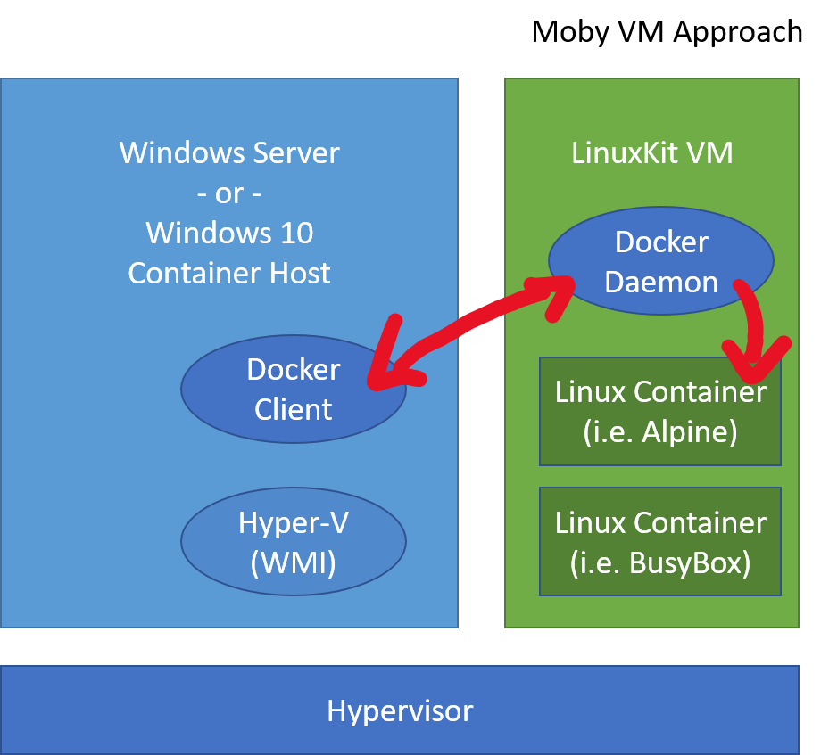
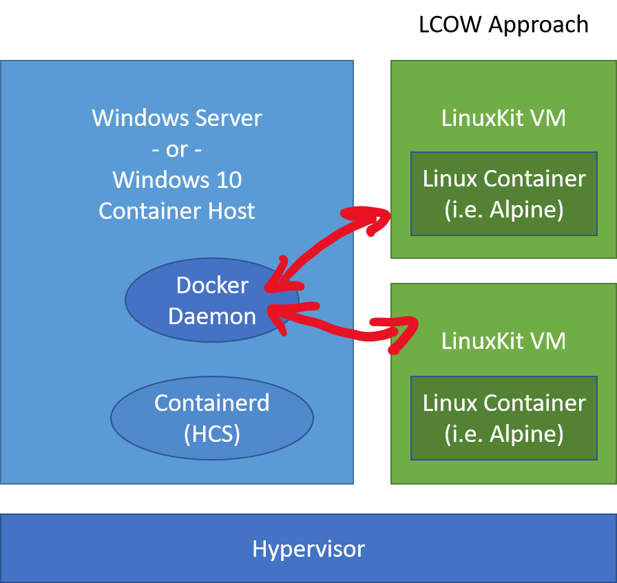
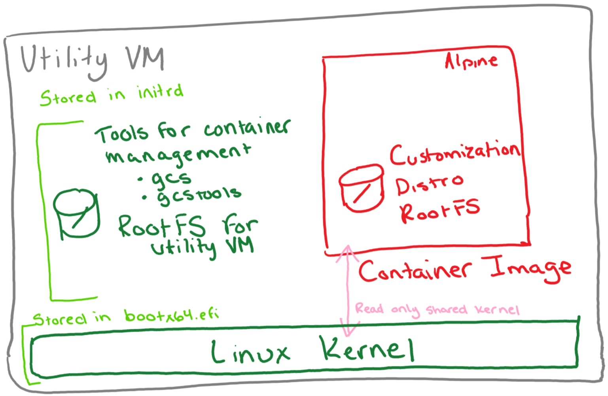

# Linux Containers on Windows

Linux containers make up a huge percent of the overall container ecosystem and are fundamental to both developer experiences and production environments.  Since containers share a kernel with the container host, however, running Linux containers directly on Windows isn't an option[*](lcow.md#other-options-we-considered).  This is where virtualization comes into the picture.

Right now there are two ways to run Linux containers with Docker for Windows and Hyper-V:

1. Run Linux containers in a full Linux VM - this is what Docker typically does today.
1. Run Linux containers with [Hyper-V Isolation](../manage-containers/hyperv-container.md) (LCOW) - this is a new option in Docker for Windows.

This article explores each of these ways of running Linux containers on Windows.

## Linux Containers in a Moby VM

Docker has been able to run Linux containers on Windows desktop since it was first released in 2016 (before Hyper-V isolation or LCOW were available) using a Linux virtual machine running on Hyper-V.

In this model, Docker Client runs on Windows desktop but calls into Docker Daemon on the Linux VM.

All Linux containers run on the same [LinuxKit](https://github.com/linuxkit/linuxkit) based virtual machine.

In this model, all Linux containers share a Linux container host and all Linux containers:

* Share a kernel with each other and the Moby VM, but not with the Windows host.
* Have consistent storage and networking properties with Linux containers running on Linux (since they are running on a Linux VM).

It also means the Linux container host (Moby VM) needs to be running Docker Daemon and all of Docker Daemon's dependencies.

To see if you're running with Moby VM, check Hyper-V Manager for Moby VM using either the Hyper-V Manager UI or by running `Get-VM` in a elevated PowerShell window.

## Linux Containers with Hyper-V isolation

Linux Containers with Hyper-V isolation run each Linux container (LCOW) in a highly optimized Linux VM with just enough OS to run containers.  In contrast to the Moby VM approach, each LCOW has it's own kernel and it's own VM sandbox.  They're also managed by Docker on Windows directly.

Taking a closer look at how container management differs between the Moby VM approach and LCOW, in the LCOW model container management stays on Windows and each LCOW management happens via GRPC and containerd.  This means the Linux distro containers run in for LCOW can have a much smaller inventory.  Right now, we're using LinuxKit for the optimized distro containers use but other projects like Kata are build similar highly-tuned Linux distros (Clear Linux) as well.

Here's a closer look at each LCOW:

To see if you're running LCOW, navigate to `C:\Program Files\Linux Containers`.  LCOW will show the minimal Linux distro running in each Hyper-V container.  Notice the optimized VM components are less than 100 MB, much smaller than the LinuxKit image in Moby VM.

### Extra information

[Linux Container Video](https://sec.ch9.ms/ch9/1e5a/08ff93f2-987e-4f8d-8036-2570dcac1e5a/LinuxContainer.mp4)

[LinuxKit LCOW-kernel plus build instructions](https://github.com/linuxkit/lcow)

## Other options we considered

When we were looking at ways to run Linux containers on Windows, we considered WSL.  Ultimately, we chose a virtualization based approach so that Linux containers on Windows have the same app compatibility as Linux containers on Linux.  There is also a gap around storage.  Many linux containers rely on mounted storage and WSL doesn't include an ext4 driver.

We may re-evaluate in the future but, for now, LCOW will continue to use Hyper-V.  If you have thoughts, please send feedback through github or UserVoice.