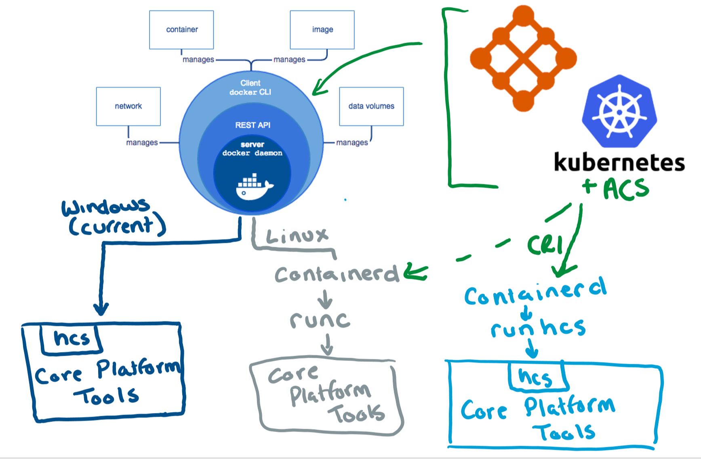

# Container platform tools in Windows

## Windows and Linux container platform

In Linux environments, container management tools like Docker are built on another, more fundamental, set of container tools - [runc](https://github.com/opencontainers/runc) and [containerd](https://containerd.io/) ([GitHub project](https://github.com/containerd/containerd)).

Runc is a Linux command line tool for creating and running containers according to the [OCI container runtime specification](https://github.com/opencontainers/runtime-spec).

Containerd is a daemon that manages the container life cycle from image transfer and storage to container execution and supervision.

To make it easier to extend container tools to run on a Windows container host in addition to the existing Linux container hosts, we've introduced a Windows counterpart to runc - [runhcs](https://github.com/Microsoft/hcsshim/tree/master/cmd/runhcs).  Further, we've worked closely with the containerd project to integrate runhcs into containerd for Windows.

## runhcs

Just like runc, runhcs runs containers defined by an OCI spec.  RunHCS can run process containers or Hyper-V containers

We're also contributing to containerd/containerd and containerd/cri to use runhcs on Windows so the windows container ecosystem use containerd for both Windows and Linux containers.

To this point, Windows hasn't had a command line tool for creating and running containers - Docker is built directly on a Windows C API called the [Host Compute Service (HCS)](https://blogs.technet.microsoft.com/virtualization/2017/01/27/introducing-the-host-compute-service-hcs/) via [hcsshim](https://github.com/Microsoft/hcsshim).  Now runhcs is the layer that calls into the HCS.

Some set up required :)

