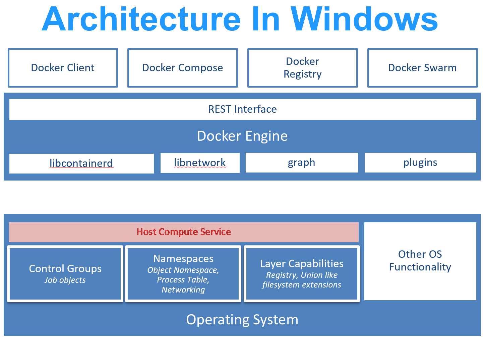
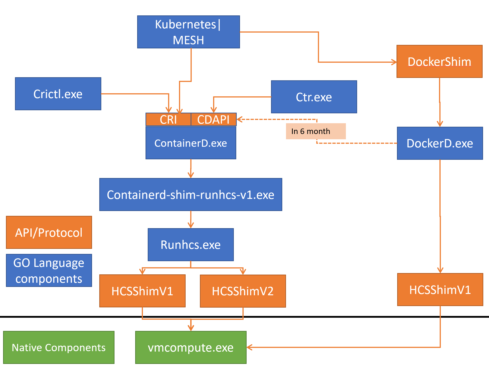

# Container platform tools in Windows

Many popular container tools depend on `runc` and `containerd`.  To make it easier for container management tools to run on a Windows container host with as little extra integration work as possible, we're introducing a Windows counterpart to runc - [runhcs](https://github.com/Microsoft/hcsshim/tree/master/cmd/runhcs).  We have also worked closely with the containerd project to integrate runhcs into containerd for Windows (including containerd/cri).

This article will talk about the Windows and Linux container platform, `runhcs`, HCS (Host Compute Service), and `containerd` on Windows.

## Windows and Linux container platform

In Linux environments, container management tools like Docker are built on another, more fundamental, set of container tools - [runc](https://github.com/opencontainers/runc) and [containerd](https://containerd.io/) ([GitHub project](https://github.com/containerd/containerd)).

`runc` is a Linux command line tool for creating and running containers according to the [OCI container runtime specification](https://github.com/opencontainers/runtime-spec).

`containerd` is a daemon that manages container life cycle from downloading and unpacking the container image through container execution and supervision.

On Windows, we initially took a different approach.  When we started working with Docker to support Windows containers, we built directly on the HCS (Host Compute Service).  Read [this blog post](https://blogs.technet.microsoft.com/virtualization/2017/01/27/introducing-the-host-compute-service-hcs/) for more information about why we built the hcs and why we took this approach.

## runhcs

Just like runc, runhcs runs containers defined by an OCI spec.  RunHCS can run process containers or Hyper-V containers

We're also contributing to containerd/containerd and containerd/cri to use runhcs on Windows so the windows container ecosystem use containerd for both Windows and Linux containers.

To this point, Windows hasn't had a command line tool for creating and running containers - Docker is built directly on a Windows C API called the [Host Compute Service (HCS)](https://blogs.technet.microsoft.com/virtualization/2017/01/27/introducing-the-host-compute-service-hcs/) via [hcsshim](https://github.com/Microsoft/hcsshim).  Now runhcs is the layer that calls into the HCS.

Some set up required :)

