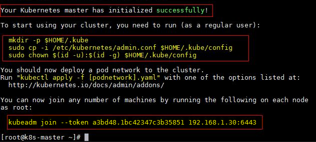

# Creating a Kubernetes Master #
> [!NOTE]
> This guide was validated on Kubernetes v1.13. Because of the volatility of Kubernetes from version to version, this section may make assumptions that do not hold true for all future versions. Official documentation for initializing Kubernetes masters using kubeadm can be found [here](https://kubernetes.io/docs/setup/independent/install-kubeadm/). Simply enable [mixed-OS scheduling section](#enable-mixed-os-scheduling) on top of that.

> [!NOTE]  
> A recently-updated Linux machine is required to follow along; Kubernetes master resources like [kube-dns](https://kubernetes.io/docs/concepts/services-networking/dns-pod-service/), [kube-scheduler](https://kubernetes.io/docs/reference/command-line-tools-reference/kube-scheduler/), and [kube-apiserver](https://kubernetes.io/docs/reference/command-line-tools-reference/kube-apiserver/) have not been ported to Windows yet. 

> [!tip]
> The Linux instructions are tailored towards **Ubuntu 16.04**. Other Linux distributions certified to run Kubernetes should also offer equivalent commands that you can substitute. They will also interoperate successfully with Windows.


## Initialization using kubeadm ##
Unless explicitly specified otherwise, run any commands below as **root**.

First, get into an elevated root shell:

```bash
sudo –s
```

Make sure your machine is up to date:

```bash
apt-get update -y && apt-get upgrade -y
```

### Install Docker ###
To be able to use containers, you need a container engine, such as Docker. To get the most recent version, you can use [these instructions](https://docs.docker.com/install/linux/docker-ce/ubuntu/) for Docker installation. You can verify that docker is installed correctly by running a `hello-world` container:

```bash
docker run hello-world
```

### Install kubeadm ###
Download `kubeadm` binaries for your Linux distribution and initialize your cluster.

> [!Important]  
> Depending on your Linux distribution, you may need to replace `kubernetes-xenial` below with the correct [codename](https://wiki.ubuntu.com/Releases).

```bash
curl -s https://packages.cloud.google.com/apt/doc/apt-key.gpg | apt-key add -
cat <<EOF >/etc/apt/sources.list.d/kubernetes.list
deb http://apt.kubernetes.io/ kubernetes-xenial main
EOF
apt-get update && apt-get install -y kubelet kubeadm kubectl 
```

### Prepare the master node ###
Kubernetes on Linux requires swap space to be turned off:

```bash
nano /etc/fstab  # (remove a line referencing 'swap.img' , if it exists)
swapoff -a 
```

### Initialize master ###
Note down your cluster subnet (e.g. 10.244.0.0/16) and service subnet (e.g. 10.96.0.0/12) and initialize your master using kubeadm:

```bash
kubeadm init --pod-network-cidr=10.244.0.0/16 --service-cidr=10.96.0.0/12
```

This may take a few minutes. Once completed, you should see a screen like this confirming your master has been initialized:



> [!tip]
> You should take note of this kubeadm join command. Shoud the kubeadm token expire, you can use `kubeadm token create --print-join-command` to create a new token.

> [!tip]
> If you have a desired Kubernetes version you'd like to use, you can pass the `--kubernetes-version` flag to kubeadm.

We are not done yet. To use `kubectl` as a regular user, run the following __**in an unelevated, non-root user shell**__

```bash
mkdir -p $HOME/.kube
sudo cp -i /etc/kubernetes/admin.conf $HOME/.kube/config
sudo chown $(id -u):$(id -g) $HOME/.kube/config
```
Now you can use kubectl to edit or view information about your cluster.

### Enable mixed-OS scheduling ###
By default, certain Kubernetes resources are written in such a way that they're scheduled on all nodes. However, in a multi-OS environment we don't want Linux resources to interfere or be double-scheduled onto Windows nodes, and vice-versa. For this reason, we need to apply [NodeSelector](https://kubernetes.io/docs/concepts/configuration/assign-pod-node/#nodeselector) labels. 

In this regard, we are going to patch the linux kube-proxy [DaemonSet](https://kubernetes.io/docs/concepts/workloads/controllers/daemonset/) to target Linux only.

First, let's create a directory to store .yaml manifest files:
```bash
mkdir -p kube/yaml && cd kube/yaml
```

Confirm that the update strategy of `kube-proxy` DaemonSet is set to [RollingUpdate](https://kubernetes.io/docs/tasks/manage-daemon/update-daemon-set/):

```bash
kubectl get ds/kube-proxy -o go-template='{{.spec.updateStrategy.type}}{{"\n"}}' --namespace=kube-system
```

Next, patch the DaemonSet by downloading [this nodeSelector](https://github.com/Microsoft/SDN/tree/master/Kubernetes/flannel/l2bridge/manifests/node-selector-patch.yml) and apply it to only target Linux:

```bash
wget https://raw.githubusercontent.com/Microsoft/SDN/master/Kubernetes/flannel/l2bridge/manifests/node-selector-patch.yml
kubectl patch ds/kube-proxy --patch "$(cat node-selector-patch.yml)" -n=kube-system
```

Once successful, you should see "Node Selectors" of `kube-proxy` and any other DaemonSets set to `beta.kubernetes.io/os=linux`

```bash
kubectl get ds -n kube-system
```


### Collect cluster information ###
To successfully join future nodes to the master, you should keep track of the following information:
  1. `kubeadm join` command from output ([here](#initialize-master))
    * Example: `kubeadm join <Master_IP>:6443 --token <some_token> --discovery-token-ca-cert-hash <some_hash>`
  2. Cluster subnet defined during `kubeadm init` ([here](#initialize-master))
    * Example: `10.244.0.0/16`
  3. Service subnet defined during `kubeadm init` ([here](#initialize-master))
    * Example: `10.96.0.0/12`
    * Can also be found using `kubectl cluster-info dump | grep -i service-cluster-ip-range`
  4. Kube-dns service IP 
    * Example: `10.96.0.10`
    * Can be found in "Cluster IP" field using `kubectl get svc/kube-dns -n kube-system`
  5. Kubernetes `config` file generated after `kubeadm init` ([here](#initialize-master)). If you followed the instructions, this can be found in the following paths:
    * `/etc/kubernetes/admin.conf`
    * `$HOME/.kube/config`

## Verifying the master ##
After a few minutes, the system should be in the following state:

  - Under `kubectl get pods -n kube-system`, there will be pods for the [Kubernetes master components](https://kubernetes.io/docs/concepts/overview/components/#master-components) in `Running` state.
  - Calling `kubectl cluster-info` will show information about the Kubernetes master API server in addition to DNS addons.
  
> [!tip]
> Since kubeadm does not setup networking, DNS pods may still be in `ContainerCreating` or `Pending` state. They will switch to `Running` state after [choosing a network solution](./network-topologies.md).

## Next steps ## 
In this section we covered how to setup a Kubernetes master using kubeadm. Now you are ready for step 3:

> [!div class="nextstepaction"]
> [Choosing a network solution](./network-topologies.md)